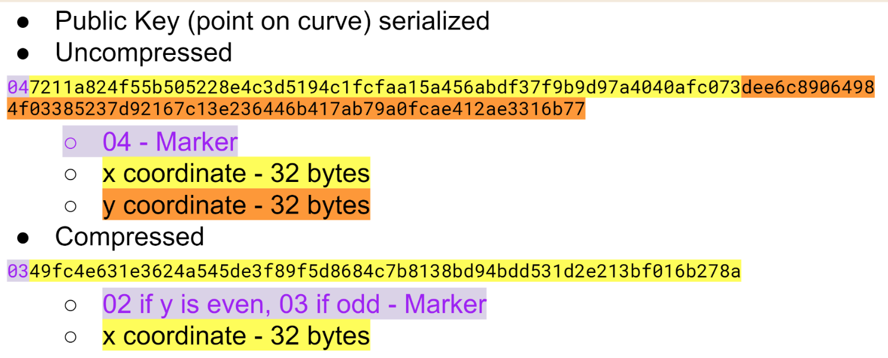

# SEC Format

It turns out there’s already a standard for serializing ECDSA public keys called SEC. SEC stands for Standards for Efficient Cryptography and as the name suggests, it’s got minimal overhead.




```python
# SEC Example

from ecc import S256Point

point = S256Point(0x5CBDF0646E5DB4EAA398F365F2EA7A0E3D419B7E0330E39CE92BDDEDCAC4F9BC, 0x6AEBCA40BA255960A3178D6D861A54DBA813D0B813FDE7B5A5082628087264DA)

uncompressed = b'\x04' + point.x.num.to_bytes(32, 'big') + point.y.num.to_bytes(32, 'big')
print(uncompressed.hex())
if point.y.num % 2 == 1:
    compressed = b'\x03' + point.x.num.to_bytes(32, 'big')
else:
    compressed = b'\x02' + point.x.num.to_bytes(32, 'big')
print(compressed.hex())
```

### Try it

#### 6.1. Find the compressed and uncompressed SEC format for pub keys where the private keys are:
```
999**3, 123, 42424242
```


```python
from ecc import G

secrets = (999**3, 123, 42424242)

# iterate through secrets
    # get public point
    # uncompressed - b'\x04' followed by x coord, then y coord
    # here's how you express a coordinate in bytes: some_integer.to_bytes(32, 'big')
    # compressed - b'\x02'/b'\x03' follewed by x coord. 02 if y is even, 03 otherwise
    # print the .hex() of both
```

### Test Driven Exercise


```python
from ecc import S256Point
from helper import double_sha256, encode_base58, hash160

class S256Point(S256Point):

    def sec(self, compressed=True):
        # returns the binary version of the sec format, NOT hex
        # if compressed, starts with b'\x02' if self.y.num is even, b'\x03' if self.y is odd
        # then self.x.num
        # remember, you have to convert self.x.num/self.y.num to binary (some_integer.to_bytes(32, 'big'))
        # if non-compressed, starts with b'\x04' followod by self.x and then self.y
        pass
```
